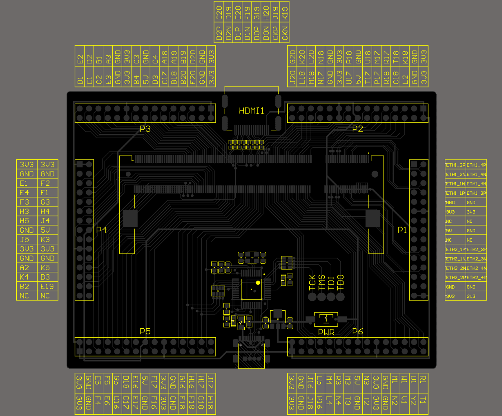
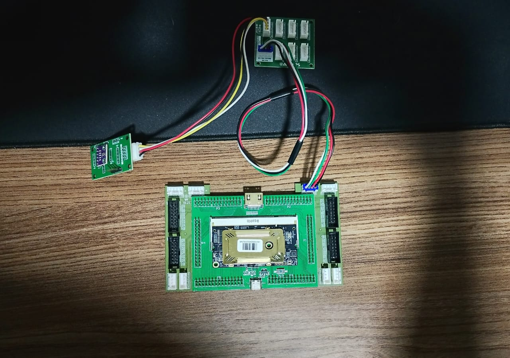

# Coletor de temperatura em tempo real com FPGA

Projeto final para a capacitação embarcatech em FPGA. 

Este projeto tem como objetivo utilizar uma FPGA para realizar a medição de temperatura através do sensor BMP280 e enviar os dados coletador para um computador através da UART.

## Autor

- [@Matheus de Alencar](https://github.com/matheus-555)

## Resumo do que foi feito

- Implementado um processador RISC-V simples utilizando o framework [Litex](https://github.com/enjoy-digital/litex).

- Implementado no processador RISC-V periférico de I2C, SPI e UART.

- Implementado em linguagem C um driver para comunicação com o sensor BMP280 via protocolo I2C.

- Implementado um software em liguagem C para realizar a leitura de temperatura através do BMP280 e enviar a medição para a UART.

## Resumo do que não foi feito

- A princípio a ideia seria utilizar o SD Card para armazenar as medições de temperatura, porém não obtive sucesso na implementação do driver de SD Card, o processador crashava quando abria um arquivo através da função f_open.

- Não consegui realizar a aquisição de umidade através do sensor AHT10, o sensor parava de responder na I2C após uma requisição de calibração.

## Passo a passo para execução deste projeto
1) Instale a tootchain, para isso siga o [Installation Guide oss-cad-suite](https://github.com/YosysHQ/oss-cad-suite-build?tab=readme-ov-file#installation)

2) Baixe o litex, para isso siga o [Quick start guide](https://github.com/enjoy-digital/litex?tab=readme-ov-file#quick-start-guide) contido no repositório do litex.

Pinout da color-light-i9


Ligação dos periféricos na color-light-i9


O mapeamento dos pinos utilizados pode ser visto no código abaixo:
```sh
    # Serial
    ("serial", 0,
        Subsignal("tx", Pins("J17")),
        Subsignal("rx", Pins("H18")),
        IOStandard("LVCMOS33")
    ),

    # BEGIN MY CONFIG

    ("i2c", 0,
        Subsignal("scl", Pins("J20")),
        Subsignal("sda", Pins("K20"), Misc("PULLMODE=UP")),
        IOStandard("LVCMOS33")
    ),

    ("spisdcard", 0,
        Subsignal("clk",  Pins("N2")),
        Subsignal("mosi", Pins("M1"), Misc("PULLMODE=UP")),
        Subsignal("miso", Pins("T2"), Misc("PULLMODE=UP")),
        Subsignal("cs_n", Pins("T3"), Misc("PULLMODE=UP")),
        IOStandard("LVCMOS33")
    ),

    # END MY CONFIG
```
O pinout completo pode ser visto [aqui](fpga/colorlight-i9/riscv-baremetal/pinout/colorlight_i5.py)

3) Execute os seguintes comandos
```sh
# Carregue as variaveis de ambiente do litex
$ source ~/litex/litex-venv/bin/activate

# --- Compilando a definição de Hardware da colorlight-i5 na colorlight-i9
$ python3 colorlight_i5.py --board i9 --revision 7.2 --build

# Carrega o bitstream na fpga
$ openFPGALoader -b colorlight-i9 ${PWD}/build/colorlight_i5/gateware/colorlight_i5.bit

# Compila o software (Nao esqueca de apontar as variáveis do MakeFile para o diretório da toolchain do GCC Risc-V)
$ python3 ${PWD}/software/demo/demo.py --build-path=${PWD}/build/colorlight_i5

# Conecta no terminal do processador e carrega o binario do código compilado
$ litex_term /dev/ttyACM0 --kernel=${PWD}/demo.bin
```